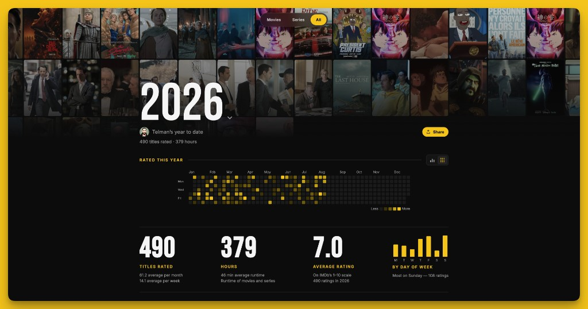

# IMDb Wrapped _(imdb-wrapped)_

[](https://telman.ru/imdb)

[](LICENSE)

Personal IMDb Wrapped — fork, paste your profile URL, drop in your export CSVs.

A year-in-review page from your public IMDb ratings: films, series, hours, genres, map, people, watchlist. Live demo: [telman.ru/imdb](https://telman.ru/imdb) ([telman3D](https://www.imdb.com/user/p.myngzks6b5tydnbl7kkgmnpmqy)).

## Install

Needs [Node](https://nodejs.org/) 20+ and [Python](https://www.python.org/) 3.10+.

```bash
git clone https://github.com/Te1man/imdb-wrapped.git
cd imdb-wrapped
npm install
```

## Usage

1. Copy the example config and paste your IMDb profile URL from the browser (`/user/p.…`, not `ur…`). Ratings and the watchlist must be **public**.

```bash
cp config.example.json config.json
```

```json
{
  "imdbUrl": "https://www.imdb.com/user/p.xxxxxxxx",
  "displayName": {
    "en": "Alex"
  },
  "telegram": ""
}
```

2. Export two CSVs from IMDb and replace the files in `data/`:

| Export | In IMDb | Save as |
| --- | --- | --- |
| Ratings | Profile → Ratings → Export | `data/ratings.csv` |
| Watchlist | Profile → Watchlist → Export | `data/watchlist.csv` |

3. Build stats and run the site:

```bash
npm run data:full
npm run dev
```

The first `data:full` run can take a few minutes (IMDb GraphQL: posters, people, badges, lists).

```bash
npm run data         # rebuild from CSV, skip most live fetches
npm run data:full    # GraphQL enrich from CSV
npm run sync         # live ratings + watchlist + OG (for auto-refresh)
npm run publish:data # sync then rsync JSON/OG to the server
npm run watchlist    # refresh watchlist.json
npm run build        # production bundle
```

## Auto-refresh (your own server)

The site loads `data/stats.json` and `data/watchlist.json` at runtime. Keep the IMDb profile (ratings, watchlist, lists) **public**.

Anyone forking this repo can run hourly updates on **their** VPS:

1. Build and deploy the static site once (`npm run build` / `build:imdb`, rsync/`scp` the `dist/` folder).
2. Copy deploy settings:

```bash
cp deploy.example.env deploy.env
# edit IMDB_DEPLOY_HOST and IMDB_DOCROOT
```

3. Push the sync pipeline to the server and install cron:

```bash
bash scripts/setup_vps_sync.sh
```

That installs an hourly job on the server (not on your laptop):

`0 * * * * cd /opt/imdb-wrapped && IMDB_DOCROOT=… ./scripts/publish_data.sh >> /var/log/imdb-wrapped-sync.log 2>&1`

Manual refresh on the server:

```bash
ssh "$IMDB_DEPLOY_HOST" "cd /opt/imdb-wrapped && ./scripts/publish_data.sh"
```

After a UI code change, rebuild and redeploy `dist/`. New ratings / watchlist / lists are handled by the server cron alone.

## Contributing

Issues and pull requests for the generator are welcome. Please do not open PRs that only swap in personal ratings CSVs.

## License

[MIT](LICENSE) © Telman

IMDb is a trademark of IMDb.com, Inc. This is an unofficial fan project and is not affiliated with IMDb.
